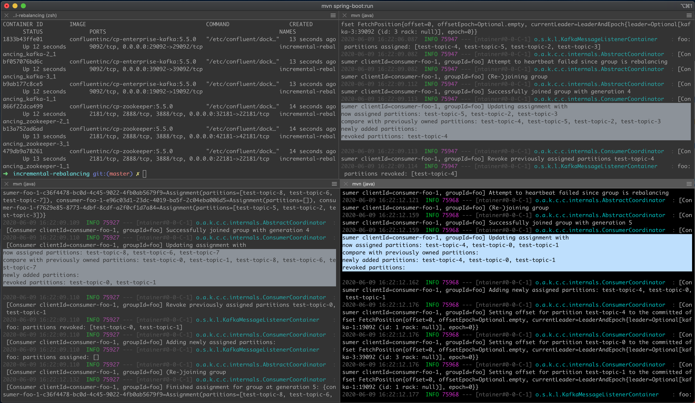

## Kafka Cooperative Incremental Rebalancing Demonstration

Kafka Cooperative Incremental Rebalancing avoids unnecessary revocations of partitions from Kafka consumer instances. This is in contrast to the tradditional management of partition assignments with the RangeAssignor, which is enabled by default. This project helps to better understand the differences by trying things out. 



### Running with Confluent Cloud

This is the easiest solution to get the demo running. No need to setup your own cluster. 

#### Prerequisites

* login to Confluent Cloud: Get a free account at https://confluent.cloud
* created an Api-key and api-secret for your account
* `mvn` command line tool 
* JDK 11 or higher
* Access to Maven Central

#### Starting the Demo

* create the `test-topic` via the UI with a few partitions
* take a look at the `application-cloud.properties` file and notice that IncrementalCooperativeRebalancing has been enabled for the Kafka consumers. 
* Insert your api-key and api-secret in this file. 
* Open a couple of terminal windows (3 will do). 
* In each terminal window start the application one after the other and watch the logs: `export SPRING_PROFILES_ACTIVE=cloud; mvn spring-boot:run` . 
* Open a couple of terminal windows (3 will do). 
* In each terminal window start the application one after the other and watch the logs: `export SPRING_PROFILES_ACTIVE=dockercompose; mvn spring-boot:run` . 
  You should see that only those partition reassignments are executed which are really 
  needed:

```
    now assigned partitions: test-topic-3, test-topic-1, test-topic-8, test-topic-6
    compare with previously owned partitions: test-topic-3, test-topic-8, test-topic-6
    newly added partitions: test-topic-1
    revoked partitions:
```

* Now edit application-cloud.properties and comment out the line that configures the CooperativeStickyAssignor. The default RangeAssignor will be used instead. 
* Stop all your application instances, and start them again. Watch the logs and see that all partitions are revoked upon each change of group membership in the consumer group. 

### Running with Docker-compose

#### Prerequisites

* `mvn` command line tool
* JDK 11 or later
* `kafka-topics` command line tool
* access to maven central for downloading dependencies 
* docker and docker-compose
* access to docker-hub for downloading the docker images

#### Starting the demo

* Start the Kafka cluster: `docker-compose up -d`. This will start a 3 broker, 3 Zookeeper cluster. 
* Adjust your `/etc/hosts` file to resolve kafka-1, kafka-2, kafka-3 to localhost: 

   127.0.0.1 kafka-1
   127.0.0.1 kafka-2
   127.0.0.1 kafka-3

* Create a test topic: `./create-topic.sh`
* take a look at the `application-dockercompose.properties` file and notice that IncrementalCooperativeRebalancing has been enabled for the Kafka consumers. 
* Open a couple of terminal windows (3 will do). 
* In each terminal window start the application one after the other and watch the logs: `export SPRING_PROFILES_ACTIVE=dockercompose; mvn spring-boot:run` . 
  You should see that only those partition reassignments are executed which are really 
  needed:

```
    now assigned partitions: test-topic-3, test-topic-1, test-topic-8, test-topic-6
    compare with previously owned partitions: test-topic-3, test-topic-8, test-topic-6
    newly added partitions: test-topic-1
    revoked partitions:
```

* Now edit application-dockercompose.properties and comment out the line that configures the CooperativeStickyAssignor. The default RangeAssignor will be used instead. 
* Stop all your application instances, and start them again. Watch the logs and see that all partitions are revoked upon each change of group membership in the consumer group. 
